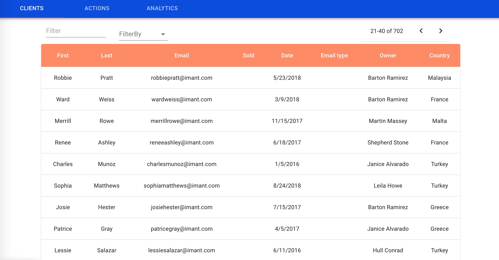
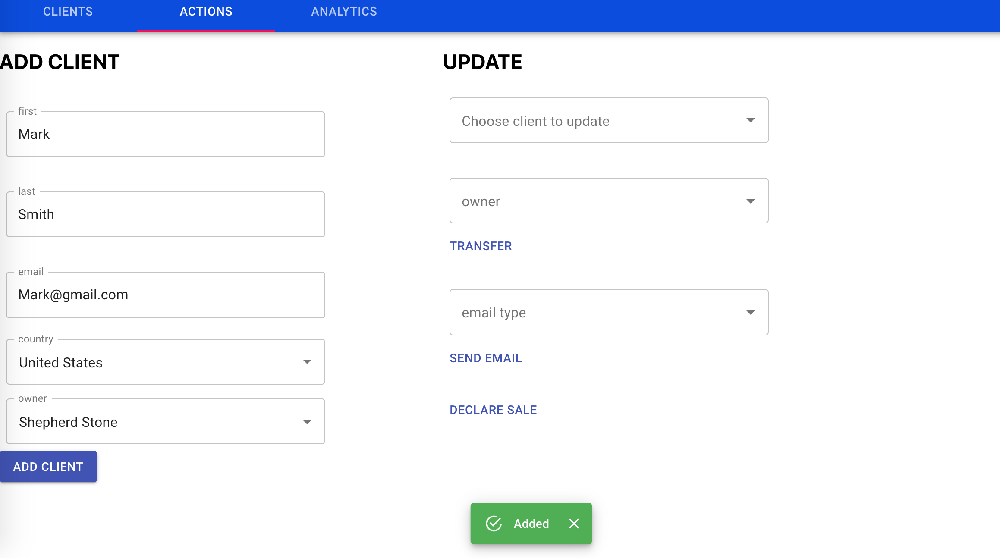
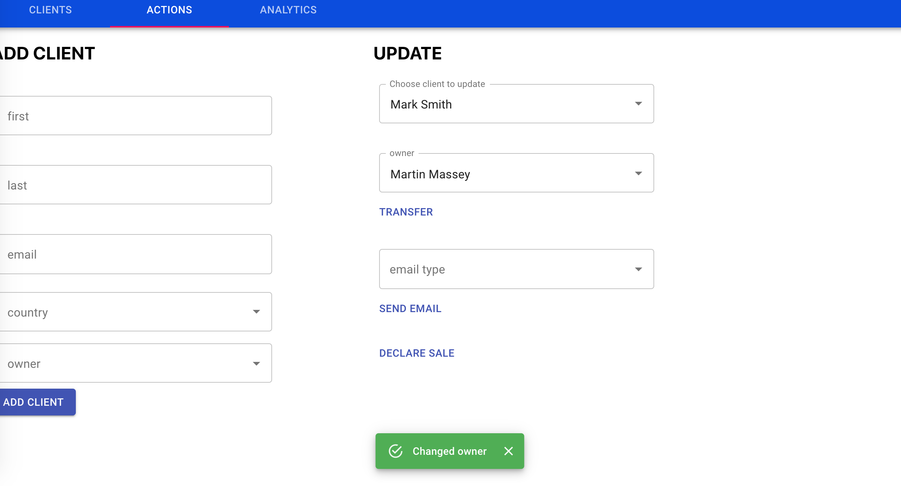
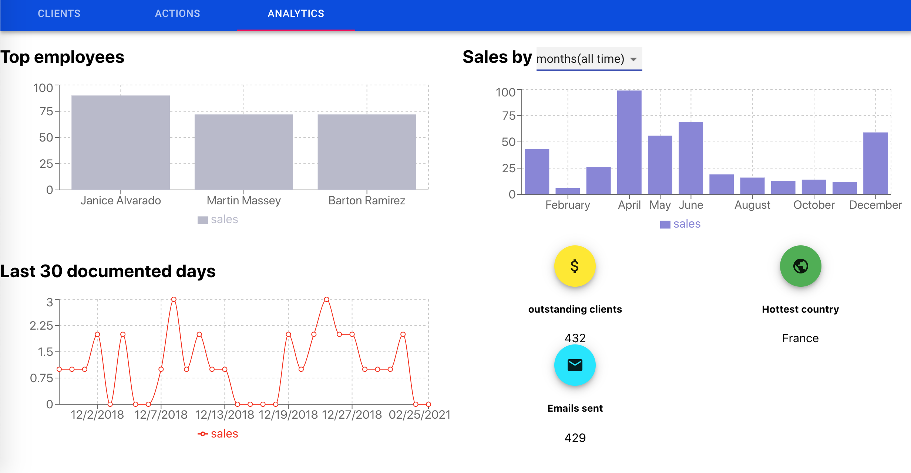

# Getting Started with CRM App

This project was bootstrapped with [Create React App](https://github.com/facebook/create-react-app).

## Available Scripts

In the project directory, you can run:

### `npm start`
### `node server`

Runs the app in the development mode.\
Open [http://localhost:3000](http://localhost:3000) to view it in the browser.

Server will run on port 3001

frontend - react, axios, recharts, mobx and material-ui

server - node.js, express and mysql

database - SQL

  

